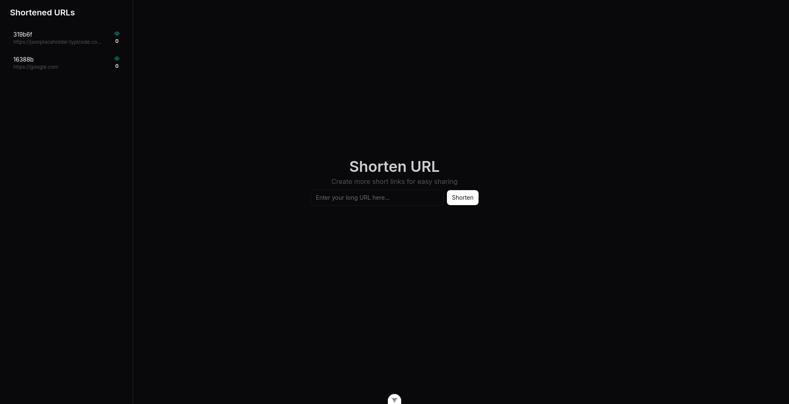

# Atlas Frontend

This repository contains the Vue.js client for the [Atlas-Infra](https://github.com/AlphaTechnolog/atlas-infra) backend. Atlas is a URL shortener service with a microservices architecture, written in Go and TypeScript, and deployed on AWS.



## Prerequisites

Before running this frontend application, you must first deploy the [Atlas-Infra](https://github.com/AlphaTechnolog/atlas-infra) project to your AWS account. Please follow the instructions provided in the `README.md` file of the `atlas-infra` repository.

After a successful deployment, you will need to obtain the following URLs from your AWS account:

*   The HTTPS URL for the `atlas-api-gateway` API Gateway.
*   The WSS URL for the `atlas-websocket-api` API Gateway.

You can find these URLs in the AWS API Gateway service console. For the WebSocket API, ensure you are looking at the `dev` stage to get the `wss://` URL.

## Configuration

Once you have the required URLs, you need to configure the local environment. This is done by creating a `.env` file. An example file is provided as `.env.example`.

The following commands assume a Unix-like operating system with a bash shell.

1.  Copy the example environment file:

    ```shell
    cp .env.example .env
    ```

2.  Open the `.env` file in a text editor and fill in the required environment variables with the URLs you obtained in the previous step.

    ```shell
    # For example, using VS Code
    code .env
    ```

## Running the Project

To run the project locally, follow these steps:

1.  Install the project dependencies:

    ```shell
    npm install
    ```

2.  Start the local development server:

    ```shell
    npm run dev
    ```

This will start the application on your local machine, and it should now be able to communicate with your deployed `atlas-infra` backend.